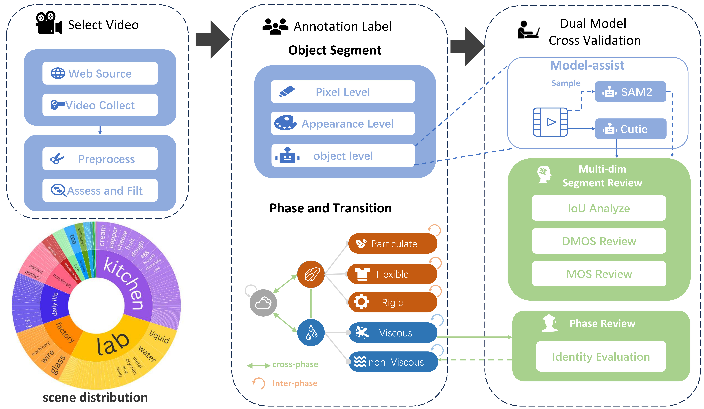
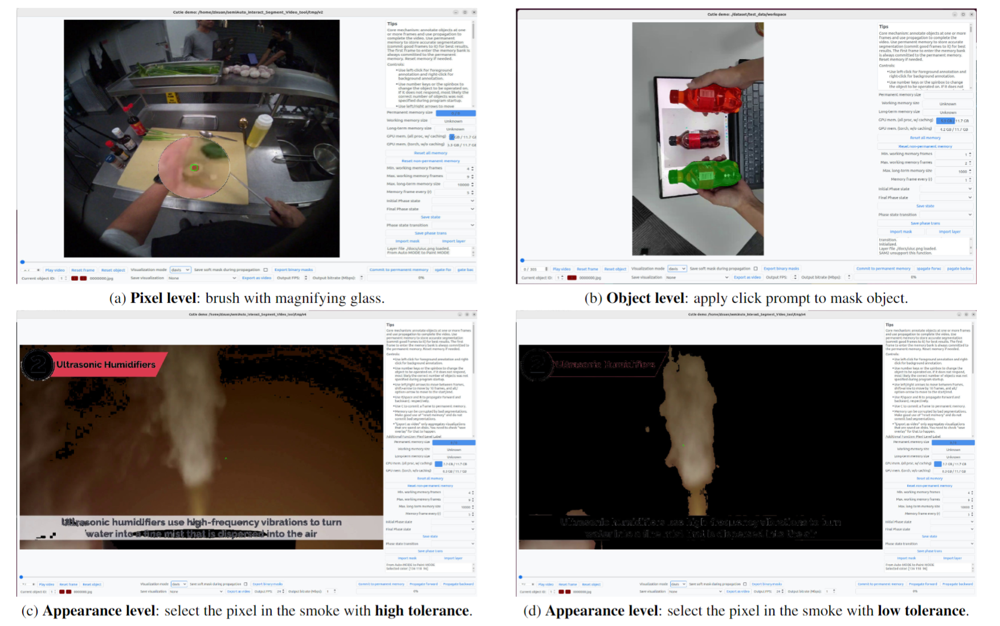

# Semi-Auto-Multi-Level-Annotation-Tool

[](https://www.linux.org/)  [](https://www.python.org/)  [](https://pytorch.org/) [](https://arxiv.org/html/2412.13803v2)  [](LICENSE)

This repo is the office implement of a Semi-Auto Multi-Level Annotation Tool used in [M-cube-VOS](https://zixuan-chen.github.io/M-cube-VOS.github.io/). It allows for user to annotate the mask of target objects efficiently. The data collection pipeline is as follow:

 


## News :fire:

- We release the Annotation Tool.

- [M$^3$-VOS](https://zixuan-chen.github.io/M-cube-VOS.github.io/) get accepted in CVPR 2025.

- We release the dataset  M$^3$-VOS in [baidu disk](https://pan.baidu.com/s/1iNh-ndhfVYupQhDHzZx5VQ?pwd=mvos).

  
# Installation

Our test environment is :

- `Python 3.8,19`

- `torch 2.3.1+cu118` , `torchaudio 2.3.1+cu118`, `torchvision 0.18.1+cu118`

**Clone our repository:**

```
git clone https://github.com/Lijiaxin0111/SemiAuto-Multi-Level-Annotation-Tool.git
```

**Install with pip:**

```
cd Semi-Auto-Multi-Level-Annotation-Tool

pip install torch==2.3.1 torchvision==0.18.1 torchaudio==2.3.1 --index-url https://download.pytorch.org/whl/cu118

pip install -r requirement.txt
```

(If you encounter the File "setup.py" not found error, upgrade your pip with pip install --upgrade pip)

**Download the pretrained models:**

```
python cutie/utils/download_models.py
```

## Usage

### Quick Start

```
python interactive_demo.py  --video ./demo_data/make_glass.mp4  --workspace ./workspace/make_glass --num_objects 1 --gpu 0
```

Tips: If you are running this on a remote server, you can use VNC or X11 forwarding.

### More Usage

- [中文文档](./doc/UI_China.md)
- [English Doc](./doc/UI_ENG.md)


## UI dmeo



## Citation

```
@misc{chen2024m3vosmultiphasemultitransitionmultiscenery,
      title={M$^3$-VOS: Multi-Phase, Multi-Transition, and Multi-Scenery Video Object Segmentation}, 
      author={Zixuan Chen and Jiaxin Li and Liming Tan and Yejie Guo and Junxuan Liang and Cewu Lu and Yong-Lu Li},
      year={2024},
      eprint={2412.13803},
      archivePrefix={arXiv},
      primaryClass={cs.CV},
      url={https://arxiv.org/abs/2412.13803}, 
}
```

## References

- This Semi-Auto-Multi-Level-Annotation-Tool is based on [Cutie GUI tool]( [https://raw.githubusercontent.com/hkchengrex/Cutie](https://raw.githubusercontent.com/hkchengrex/Cutie/main/docs/sources.txt)), [IVS](https://github.com/seoungwugoh/ivs-demo), [MiVOS](https://github.com/hkchengrex/MiVOS), and [XMem](https://github.com/hkchengrex/XMem).

  - The Cutie GUI tools uses [RITM](https://github.com/SamsungLabs/ritm_interactive_segmentation) for interactive image segmentation. This repository also contains a redistribution of their code in `gui/ritm`. That part of code follows RITM's license.

  - For automatic video segmentation/integration with external detectors, see [DEVA](https://github.com/hkchengrex/Tracking-Anything-with-DEVA).

  -  [Cutie GUI tool]( [https://raw.githubusercontent.com/hkchengrex/Cutie](https://raw.githubusercontent.com/hkchengrex/Cutie/main/docs/sources.txt)) used [ProPainter](https://github.com/sczhou/ProPainter) in the video inpainting demo.


- Thanks to [Cutie]( [https://raw.githubusercontent.com/hkchengrex/Cutie](https://raw.githubusercontent.com/hkchengrex/Cutie/main/docs/sources.txt)), [RTIM](https://github.com/SamsungLabs/ritm_interactive_segmentation), [XMem++](https://github.com/max810/XMem2), [IVS](https://github.com/seoungwugoh/ivs-demo), [MiVOS](https://github.com/hkchengrex/MiVOS), and [XMem](https://github.com/hkchengrex/XMem) for making this possible.


## License

This project is licensed under the [MIT License ](https://chat.sjtu.edu.cn/c/LICENSE). You are free to use, modify, and distribute the code, provided that the original copyright notice and license are included.

